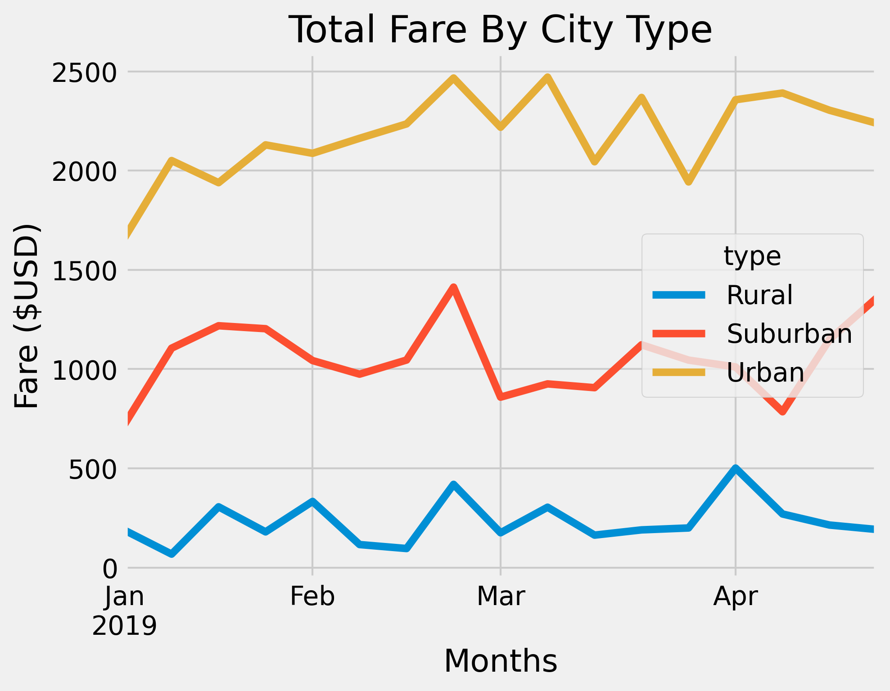

# PyBer Analysis

## Overview of Project
Pyber is a ridesharing app built on Python, and we conducted an analysis to assist the company in exploring a variety of visualization methods. To accomplish this task, we utilized Python scripts with the aid of Pandas libraries, Jupyter Notebook, and Matplotlib - a data visualization platform and graphical plotting library that creates charts to display data relationships.

The primary dataset was categorized by the type of city, number of drivers and riders, and the percentage of total fares. We also analyzed the percentage of riders and drivers based on the city type. In the following sections, we will discuss the insights that emerged from this analysis.

## Results
The analysis revealed significant differences between each city type. Urban cities, with 1625 drivers, have more than twice the number of riders and drivers compared to suburban cities (625) and rural cities (125). Consequently, the total fares spent in urban cities ($39,854.38) is twice the amount spent in suburban cities ($19,356.33) and nine times the amount spent in rural cities ($4,327.93).

Moreover, there is a discrepancy in the number of drivers compared to the total rides given. Urban cities have 2405 drivers, while suburban and rural cities have fewer ride sharers than drivers. In rural cities, the average fare per driver is $55.49, which is over three times the amount for urban city drivers ($16.57). Additionally, the average fare per ride in rural cities is $10 more than in urban cities ($30.97). Rural cities have the least number of drivers compared to urban and suburban cities.

The chart indicates that suburban and urban cities had their highest fare peak in February and March, while rural cities had the highest peak in April. Overall, the analysis confirmed that in 2019, urban cities had the highest fares, while rural cities had the least.

## Summary
Due to the disparities among city type, I would recommend an increase in the number of drivers within the rural areas in hopes of increasing revenue and access to the residents. I also recommend a slight decrease in fare price. As well as an increase in suburban drivers or a distribution of urban drivers to the suburban and rural cities.

Software/Tools
* Python
* Jupyter Notebooks
* Matplotlib
